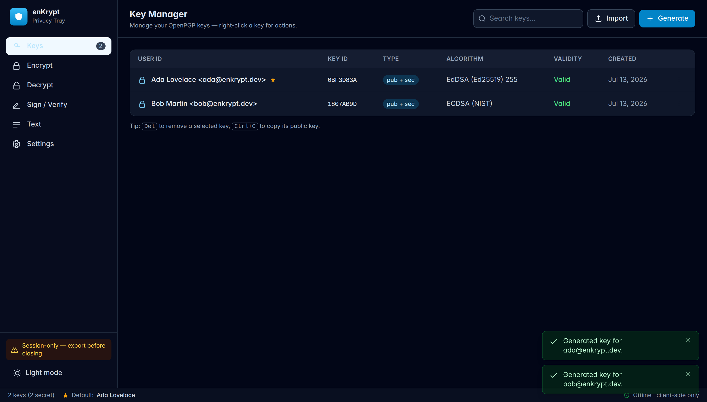
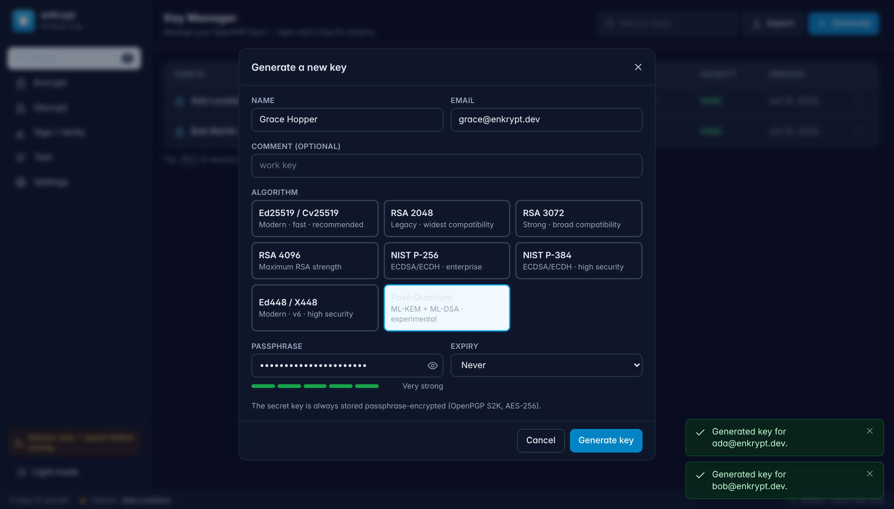
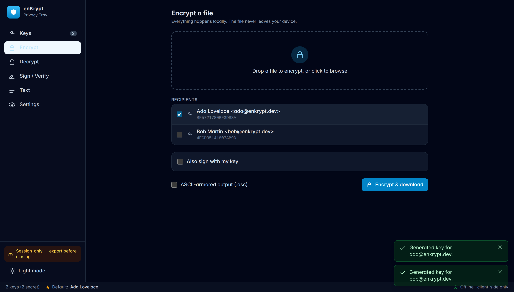
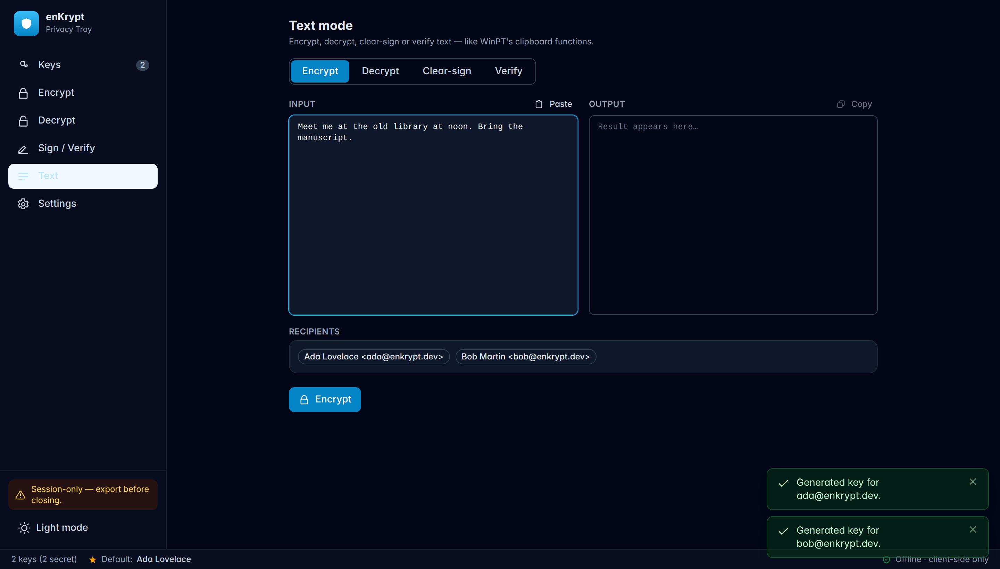

# enKrypt — OpenPGP Privacy Tray


-000000?logo=rust&logoColor=white)


A 100% client-side OpenPGP file-encryption web app — a modern, browser-based
reimagining of **WinPT** (Windows Privacy Tray). All cryptography runs locally in
your browser via Rust compiled to WebAssembly. **There are zero network calls at
runtime**: no telemetry, no keyservers, no APIs. Files and keys never leave your
machine, and the whole thing ships as plain static files you can host anywhere.

<p align="center"><em>Generate & manage keys · Encrypt/decrypt files · Sign/verify · Clipboard text mode · Installable offline PWA</em></p>

<p align="center">
  
</p>

---

## 🧩 Built on WebAssembly — and what I learned building it

I built enKrypt to learn **WebAssembly** for real — not a toy "hello world", but a
genuine, security-critical workload. The **entire OpenPGP engine is Rust compiled
to `wasm32-unknown-unknown`** and executed in the browser. There is no backend
doing cryptography; **the WebAssembly module _is_ the crypto.**

> **Why this is the whole point:** because the cryptography runs as WebAssembly on
> the client, your private keys and files never touch a server — there is no
> server to touch. That guarantee is only possible *because* of WASM: it lets a
> mature, pure-Rust OpenPGP library ([`rpgp`](https://crates.io/crates/pgp)) run
> at near-native speed inside a browser tab, with **zero network calls**.

### How it fits together

```
 Rust crate (rpgp)  ──wasm-pack──►  enkrypt_core.wasm  ──►  Web Worker  ──►  Svelte 5 UI
   OpenPGP logic       + wasm-bindgen                     (off main thread)   (typed RPC)
```

- **Rust → wasm-bindgen → TypeScript, fully typed.** The Rust core exposes a small
  API and `serde` + `tsify` **generate the `.d.ts`**, so the JavaScript side is
  type-checked against the Rust structs — no hand-written glue that can drift.
- **A Web Worker owns the wasm instance.** Keygen (including RSA-4096 and
  post-quantum, which take seconds) and large-file encryption run off the main
  thread, so the UI never freezes. Data crosses as **transferable `ArrayBuffer`s**
  to avoid copies.
- **Strict CSP with `wasm-unsafe-eval`** — WebAssembly compiles and runs, but
  arbitrary JavaScript `eval` stays blocked.

### The hard parts I had to solve (the real learning)

Getting a large Rust crypto library to actually _run_ in a browser surfaced
problems you never hit in a tutorial — this is where most of the learning was:

| Problem | What was really happening | How I fixed it |
| --- | --- | --- |
| Every keygen/sign trapped with `unreachable` | rpgp calls `SystemTime::now()`, and `std::time` **panics on `wasm32-unknown-unknown`** — there is no OS clock | Enabled rpgp's `wasm` feature, which swaps in the **`web-time`** crate (a browser clock). The one change that made everything work. |
| `wasm-opt` refused to optimise the build | rustc emits **bulk-memory** instructions that `wasm-opt` rejects by default | Passed `--enable-bulk-memory` (+ sign-ext, mutable-globals, …) via `Cargo.toml` metadata; `-Oz` then minimises size |
| The UI froze during key generation | crypto was running on the main thread | Moved all of it into a **Web Worker** behind a small typed request/response RPC layer |
| Randomness failed in the browser | `getrandom` needs a JS backend on wasm | `getrandom/js` (also pulled in by the `wasm` feature) → `crypto.getRandomValues` |

### Proof it actually works

This isn't a demo that merely compiles — it's verified end-to-end:

- ✅ **Rust tests pass** — keygen, encrypt↔decrypt, sign↔verify, vault, and every
  algorithm family — and it **decrypts a real message produced by GnuPG 2.4**
  (true interoperability, not just self-consistency).
- ✅ **Verified in a real browser**: generated Ed25519 **and post-quantum
  (ML-DSA-65)** keys and ran a full encrypt→decrypt round-trip *through the
  worker*, under the strict CSP, with **zero network requests and zero CSP
  violations**.
- ✅ Final artifact: **~2.7 MB wasm (~0.87 MB gzipped)** after `wasm-opt -Oz`,
  precached by a service worker so the app **runs completely offline**.

Curious about the boundary? The generated TypeScript types are in
`web/src/wasm/enkrypt_core.d.ts`, the Rust exports are in `crypto-core/src/lib.rs`,
and the worker that drives the wasm is in `web/src/lib/worker/`.

---

## Screenshots

<table>
  <tr>
    <td width="50%">
      
      <p align="center"><em>Generate a key — legacy RSA/NIST through post-quantum, with a live passphrase-strength meter.</em></p>
    </td>
    <td width="50%">
      
      <p align="center"><em>Encrypt a file to one or more recipients, optionally signing — all in-browser.</em></p>
    </td>
  </tr>
  <tr>
    <td width="50%">
      
      <p align="center"><em>Text mode — encrypt, decrypt, clear-sign or verify messages (WinPT's clipboard functions).</em></p>
    </td>
    <td width="50%">
      
      <p align="center"><em>The Key Manager — search, right-click actions, and a live status bar.</em></p>
    </td>
  </tr>
</table>

---

## Highlights

- **Real OpenPGP**, done in Rust — the pure-Rust [`rpgp`](https://crates.io/crates/pgp)
  library compiled to `wasm32-unknown-unknown`. No `gpgme`, no Sequoia/C deps, no
  JavaScript crypto for the OpenPGP logic. Interop-tested against **GnuPG 2.4**.
- **Decades of algorithms, from legacy to post-quantum** — import, decrypt and
  verify keys and messages spanning ~30 years of OpenPGP: RSA, DSA, ElGamal and
  legacy ciphers, NIST ECDSA/ECDH, Ed25519/Cv25519, Ed448/X448, right through to
  **post-quantum ML-KEM + ML-DSA** (draft RFC). Generation offers Ed25519
  (default), RSA-2048/3072/4096, NIST P-256/P-384, Ed448, and an experimental
  post-quantum option — so a key you make today can be as compatible or as
  future-proof as you need.
- **Off the main thread** — every crypto operation runs inside a Web Worker, so
  keygen (even the heavy post-quantum and RSA-4096 ones) and large-file
  encryption never freeze the UI.
- **Two storage modes** — *session-only* (memory, nothing on disk) or *persistent*
  (IndexedDB). Secret keys are always stored as OpenPGP S2K-encrypted packets
  (AES-256). An optional **vault passphrase** wraps the entire keyring with
  AES-256-GCM under an **Argon2id**-derived key.
- **Offline-first PWA** — a service worker precaches every asset (including the
  `.wasm`), so it runs with the network fully disconnected.
- **Strict CSP, no external anything** — `connect-src 'self'`, no CDNs, no external
  fonts, no `eval`. Everything is bundled.
- **Polished desktop-app feel** — sidebar nav, dark/light themes, a WinPT-style Key
  Manager with a right-click context menu, toasts, accessible focus-trapped
  dialogs, drag-and-drop, keyboard shortcuts, and progress indication.

---

## Architecture

```
┌──────────────────────────────────────────────────────────────────────┐
│  Browser tab (main thread)                                             │
│                                                                        │
│   Svelte 5 UI  ──────────────►  typed RPC client  ──postMessage──┐     │
│   (Key Manager, Encrypt,        (web/src/lib/worker/rpc.ts)       │     │
│    Decrypt, Sign, Text,                                           │     │
│    Settings)                                                      │     │
│        │                                                          ▼     │
│        │  reactive stores                          ┌───────────────────┐│
│        │  (keyring, theme, toasts)                 │  Web Worker       ││
│        ▼                                           │  crypto.worker.ts ││
│   IndexedDB (idb)                                  │        │          ││
│   • persistent keyring                             │        ▼          ││
│   • optional Argon2id+AES-GCM vault blob           │  enkrypt-core.wasm ││
│                                                    │  (rpgp / Rust)    ││
│                                                    └───────────────────┘│
└──────────────────────────────────────────────────────────────────────┘
        No network. Ever. (CSP: connect-src 'self' — local wasm only.)
```

**Data flow (encrypt):** UI reads a `File` → `ArrayBuffer` → transferred to the
worker → `rpgp` encrypts to the recipients' public keys (optionally signing) →
bytes transferred back → downloaded via a Blob URL.

### Monorepo layout

```
crypto-core/              Rust crate (cdylib) — the OpenPGP core, wasm-bindgen exports
  src/
    lib.rs                #[wasm_bindgen] API surface
    keys.rs               keygen, parse, metadata, export, revocation
    ops.rs                encrypt / decrypt / sign / verify / cleartext
    vault.rs              Argon2id + AES-256-GCM keyring sealing
    model.rs              serde + Tsify structs (generate TS types)
    error.rs              rich, typed errors ({ code, message })
  tests/                  roundtrip + GnuPG interop tests (+ fixtures)

web/                      Svelte 5 + TS + Vite + Tailwind app
  src/
    wasm/                 generated wasm-pack output (built artifact)
    lib/worker/           crypto Web Worker + typed RPC layer
    lib/stores/           runes-based stores (keyring, theme, toasts, nav)
    lib/db/               IndexedDB (idb) persistence
    lib/components/       Dialog, DropZone, Icon, Toasts, …
    lib/views/            KeysView (Key Manager), Encrypt, Decrypt, Sign, Text, Settings
  tests/                  Vitest tests for the RPC + utils

justfile                  build orchestration (wasm → web)
```

---

## Prerequisites

- **Rust** (stable) + the wasm target: `rustup target add wasm32-unknown-unknown`
- **wasm-pack**: `cargo install wasm-pack` (or the [installer script](https://rustwasm.github.io/wasm-pack/installer/))
- **Node.js** ≥ 20 and npm

## Build

With [`just`](https://github.com/casey/just):

```bash
just install      # npm install in web/
just build        # builds the wasm, then the web bundle → web/dist/
```

Or the equivalent raw commands:

```bash
# 1) Build the Rust crypto core to WebAssembly (release, wasm-opt -Oz)
cd crypto-core
wasm-pack build --target web --release --out-dir ../web/src/wasm

# 2) Build the web app
cd ../web
npm install
npm run build     # type-checks with svelte-check, then vite build → web/dist/
```

The production bundle lands in **`web/dist/`** — a folder of static files.

### Run locally (dev)

```bash
just build-wasm   # once, to generate web/src/wasm
just dev          # vite dev server → http://localhost:5173
```

### Preview the production build

```bash
just preview      # → http://localhost:4173
```

---

## Self-hosting

### Docker (recommended)

enKrypt ships as a **single, self-contained container image** built for exactly
this — homelabs, organisations, and anyone who wants to run it themselves. The
image is a multi-stage build (Rust→wasm, then Vite, then a hardened
`nginx-unprivileged` runtime) and comes out to ~55 MB. It serves only static
files; all cryptography runs in the visitor's browser.

```bash
docker compose up -d --build        # → http://localhost:8080
# or, without compose:
docker build -t enkrypt:latest .
docker run --rm -p 8080:8080 --read-only --tmpfs /tmp \
  --cap-drop ALL --security-opt no-new-privileges enkrypt:latest
```

The container:

- runs as a **non-root** user (uid 101) and listens on **8080**;
- is designed to run **read-only** with a `tmpfs` for `/tmp`, **all Linux
  capabilities dropped**, and `no-new-privileges` (see `docker-compose.yml`);
- needs **no volumes, no database, and no outbound network access**;
- serves `.wasm` with the correct MIME type, pre-gzips assets, caches
  content-hashed files for a year, and does SPA fallback (see
  `deploy/nginx.conf`).

Put it behind your existing reverse proxy (Traefik/Caddy/nginx) for TLS. It is
multi-arch: the CI workflow (`.github/workflows/ci.yml`) publishes
`linux/amd64` + `linux/arm64` images to a registry on each `v*` tag, so it runs
on a Raspberry Pi as happily as on a server. Point it at another registry (e.g.
a self-hosted Gitea) by editing the `REGISTRY`/`IMAGE` values.

### Bare static files

enKrypt is ultimately **just static files**. Copy `web/dist/` to any web server. Two rules:

1. **Serve `.wasm` with `Content-Type: application/wasm`.** Streaming
   instantiation (and some browsers) require the correct MIME type. Most modern
   servers already do this; verify if the wasm fails to load.
2. **SPA fallback** — serve `index.html` for unknown routes (the PWA already
   handles navigation, but a fallback avoids 404s on refresh).

### nginx

```nginx
server {
    listen 80;
    root /var/www/enkrypt;          # contents of web/dist
    types { application/wasm wasm; }
    location / { try_files $uri /index.html; }
}
```

### Caddy

```
example.com {
    root * /var/www/enkrypt
    file_server
    try_files {path} /index.html
}
# Caddy already serves .wasm as application/wasm.
```

### Quick local static server

```bash
cd web/dist
python3 -m http.server 8080      # Python serves .wasm as application/wasm
```

Because there are **no runtime network calls**, you can then pull the network
cable / go offline and the app keeps working. Once loaded (or "installed" as a
PWA), it runs entirely offline.

---

## Security model

- **Everything is local.** No servers, no telemetry, no keyservers, no analytics.
  The only fetch the app ever makes is for its own bundled assets (the wasm,
  JS, CSS), all same-origin. Prove it: load the app, disconnect the network, and
  keep using it.
- **Strict Content-Security-Policy** (injected into the built `index.html`):
  ```
  default-src 'self'; connect-src 'self'; object-src 'none';
  script-src 'self' 'wasm-unsafe-eval'; style-src 'self' 'unsafe-inline';
  img-src 'self' data:; font-src 'self'; worker-src 'self' blob:;
  base-uri 'self'; form-action 'none'; frame-ancestors 'none'
  ```
  `'wasm-unsafe-eval'` permits WebAssembly compilation **without** enabling
  arbitrary JS `eval`. `connect-src 'self'` allows only same-origin loading of the
  local `.wasm`/manifest — no external host can be reached.
- **Secret keys are never stored in plaintext.** Generation always produces
  passphrase-protected keys (OpenPGP S2K, AES-256 CFB). Export of a secret key
  emits the same S2K-encrypted packets — never an unlocked form.
- **Optional vault layer.** In persistent mode you can add an app-level vault
  passphrase. The whole keyring blob is sealed with **AES-256-GCM** under a key
  derived by **Argon2id** (64 MiB, t=3, p=4 — RFC 9106 parameters) before being
  written to IndexedDB.
- **Zeroization.** Sensitive buffers in the Rust core (e.g. derived vault keys)
  are wiped with the `zeroize` crate after use; rpgp zeroizes secret key material
  internally.
- **Passphrases** use `type="password"` inputs, are never logged, and are never
  persisted. The optional "remember for this session" cache lives only in memory
  and is cleared on wipe / tab close.
- **"Wipe all local data"** in Settings clears IndexedDB and in-memory state.

### Rust ↔ JS API surface

The wasm-bindgen exports (TypeScript types generated via `serde` + `tsify`):

| Function | Purpose |
| --- | --- |
| `generate_key(opts) -> KeyBundle` | Ed25519/Cv25519 (default) or RSA-3072/4096, passphrase-locked |
| `parse_key(bytes) -> KeyInfo` | Metadata from armored or binary, public or secret |
| `export_public(bytes) -> String` / `export_secret(bytes) -> String` | Re-armor (secret stays S2K-encrypted) |
| `encrypt(data, recipients, sign_with?, sign_pass?, armor) -> Uint8Array` | Multi-recipient, optional signing |
| `decrypt(data, secret_keys, passphrase, verify_keys) -> DecryptResult` | Auto-selects key, verifies signatures |
| `sign_detached / verify_detached` | Detached signatures (`.sig` / `.asc`) |
| `sign_cleartext / verify_cleartext` | Clear-signed text (clipboard mode) |
| `generate_revocation(secret, pass, reason_code, reason) -> String` | Armored revocation certificate |
| `vault_seal / vault_open` | Argon2id + AES-256-GCM keyring sealing |

Errors cross the boundary as a structured `{ code, message }` object, so the UI
shows precise messages: `wrong_passphrase`, `no_matching_key`, `corrupt_data`,
`bad_signature`, `invalid_key`, `bad_params`, `vault_error`, `internal`.

---

## Testing

```bash
just test            # Rust core + web
# or individually:
cd crypto-core && cargo test     # keygen, encrypt↔decrypt, sign↔verify,
                                 # wrong-passphrase, vault, + GnuPG interop fixture
cd web && npm test               # Vitest: worker RPC layer + utils
```

The Rust suite includes a **GnuPG interoperability test**: it decrypts a message
produced by GnuPG 2.4 (fixtures in `crypto-core/tests/fixtures/`), proving
real-world compatibility.

---

## Notes & limitations

- **Default keys are Ed25519 (sign/certify) + Cv25519/X25519 (encrypt), v4** — the
  same widely-compatible "modern" key GnuPG produces by default. RSA-2048/3072/4096
  and NIST P-256/P-384 are v4 (understood by every GnuPG); Ed448 and the
  post-quantum option are v6 (RFC 9580 / draft-PQC) and only interoperate with
  very recent OpenPGP implementations. The **post-quantum** option (ML-DSA-65 +
  ML-KEM-768) is experimental — it tracks a draft RFC, so treat generated PQC
  keys as forward-looking rather than universally interoperable.
- **Key expiry** is collected in the UI and enforced at the application layer
  (validity display + warnings). rpgp 0.20's high-level key builder does not embed
  a key-expiration self-signature subpacket, so expiry is not written into the
  OpenPGP certificate itself.
- **Literal filenames** are not embedded on encrypt (rpgp 0.20's high-level
  `MessageBuilder` doesn't set them), so on decrypt the app derives the output
  name by stripping the `.gpg`/`.asc`/`.pgp` suffix — the standard behaviour of
  GnuPG front-ends.
- **wasm size:** ~2.4 MB (≈800 KB gzipped) after `wasm-opt -Oz`.

---

## License

MIT — see [LICENSE](LICENSE).
